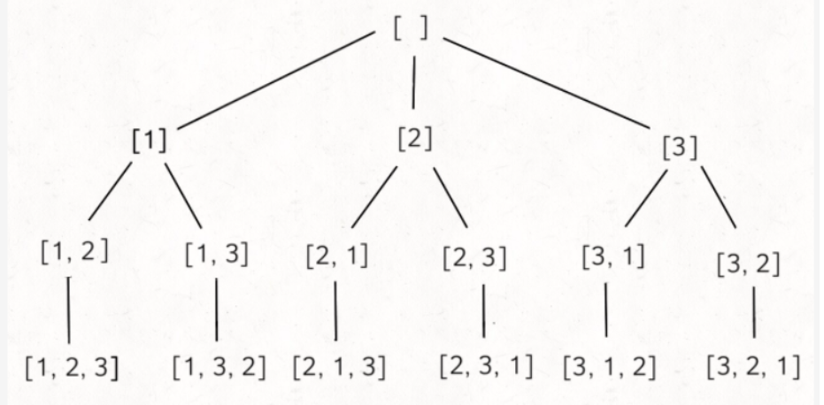

# [46. 全排列](https://leetcode-cn.com/problems/permutations/)

### 解题思路
使用回溯算法



### 代码实现

```js
var permute = function(nums) {
    const path = [],res = [];
    backTracking(nums,nums.length,[])
    return res;
    function backTracking(n,k,used){
        if(path.length == k){
            //将path中的元素浅拷贝
            res.push(Array.from(path))
            return
        }
        //遍历元素
        for(let i=0 ; i<k ; i++){
            //如果已经在数组中就继续
            if(used[i]) continue;
            path.push(n[i])
            //记录元素已经遍历过
            used[i] = true
            //递归处理剩余元素
            backTracking(n,k,used)
            //撤销处理
            path.pop()
            used[i] = false
        }
    }
};
```

### 回溯是什么

是一种纯暴力搜索，解决无法用n层for循环嵌套的情况

递归函数下面的部分就是回溯的部分


二叉树横向是for循环，纵向是递归

回溯模板：

```js
function backTracking(参数){
    if(终止条件){
        收集结果
        return;
    }
    for(遍历集合的每一个元素){
        处理节点
        递归函数
        回溯操作(撤销处理节点情况)
    }
    return 结果
}
```

