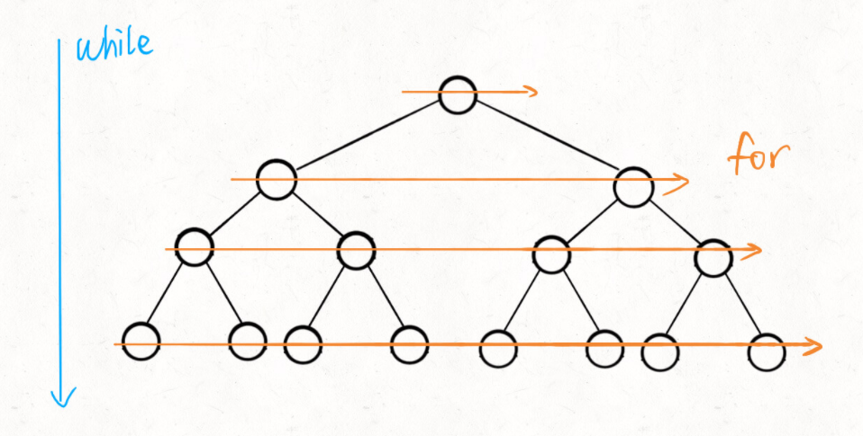

# [111. 二叉树的最小深度](https://leetcode-cn.com/problems/minimum-depth-of-binary-tree/)

### 解题思路

1. 起点就是root根节点，终点就是最靠近根节点的叶子结点
2. while循环控制一层一层往下走，for循环利用len控制从左到右遍历每一层二叉树节点

### 代码实现

```js
var minDepth = function(root) {
    if(root === null) return 0;
    let q = [];
    let height = 1;
    q.push(root)
    while(q.length != 0){
        let len = q.length
        for(let i=0 ; i<len ; i++){
            const node = q.shift()
            if(node.left == null && node.right == null) return height;
            if(node.left) q.push(node.left)
            if(node.right) q.push(node.right)
        }
        height++;
    }
    return height
};
```


### BFS 广度优先算法

框架：
```js
 function BFS (root,target){
     //核心数据结构队列
     const q = [];
     //记录扩散的步数
     let step = 0;
     //将起点加入队列
     q.push(root)
     
     while(q.length){
         let len = q.length;
         for(let i=0 ; i<len ; i++){
             const node = q.shift()
             //判断是否到达终点
             if(node == target) return step
             if(node.left) q.push(node.left)
             if(node.right) q.push(node.right)
         }
         step++
     }
 }
```
