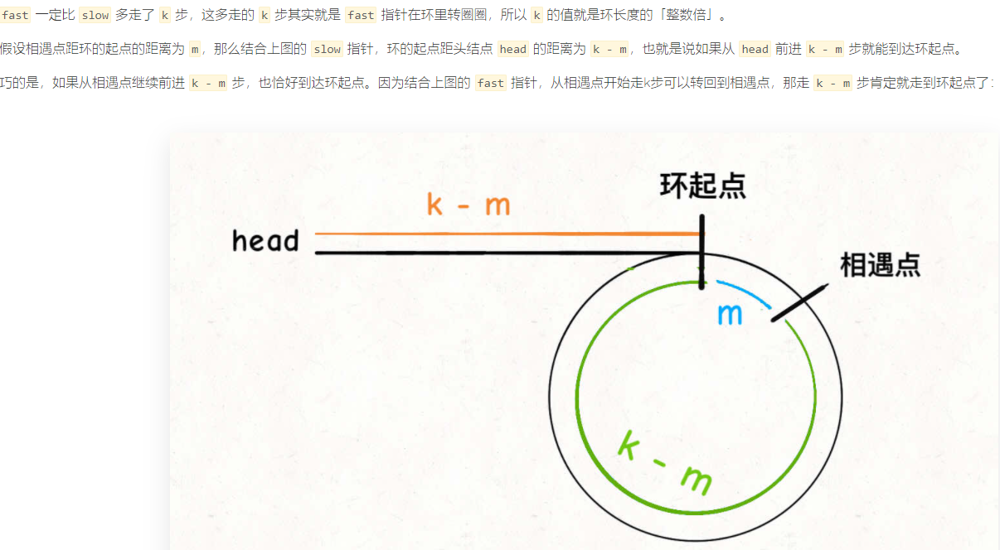

# [160. 相交链表](https://leetcode-cn.com/problems/intersection-of-two-linked-lists/)

### 解题思路

1. 快慢指针，慢指针一次走一步，快指针一次走两步，如果相遇，就代表有环，break

2. 快慢指针相遇时，slow走了k步，fast走了2k步，多走的k就是fast在环中在转圈，k是环长度的整数倍


3. 将任意一个指针再指向head，同时走，相遇就是环起点

### 代码实现

```js
var detectCycle = function(head) {
    let fast = slow = head
    while(fast !== null && fast.next !== null){
        fast = fast.next.next
        slow = slow.next
        //相遇就break
        if(fast == slow) break
    }
    //碰到null，表示没有环
    if(fast == null || fast.next == null) return null
    //将slow重新指向head
    slow = head
    //两者再次相遇时就是环起点
    while(slow != fast){
        fast = fast.next
        slow = slow.next
    }
    return slow
};
```

