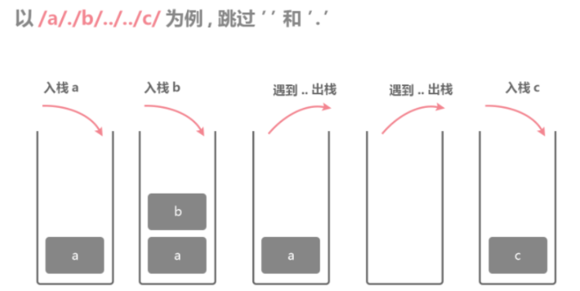

# [71. 简化路径](https://leetcode-cn.com/problems/simplify-path/)

### 解题思路
以'/'分割字符串，栈维护具体看图

1. 遇到'..'返回上一级，pop
2. 空字符串、'.'不用处理

### 代码实现
```js
var simplifyPath = function(path) {
    let arr = path.split('/')
    let stack = []
    for(let name of arr){
        if(name == '..'){
            if(stack.length){
                stack.pop()
            }
        }else if(name.length && name !== '.'){
            stack.push(name)
        }
    }
    return '/' + stack.join('/')
};
```