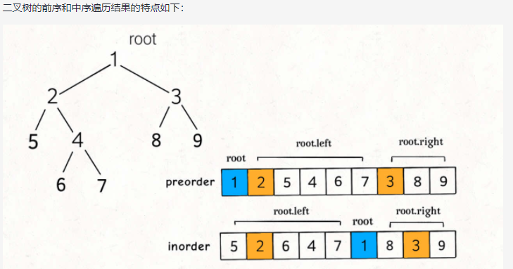
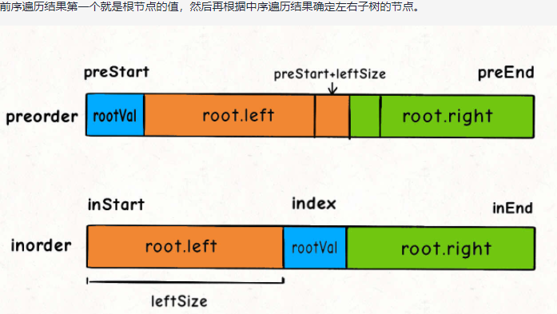

#### 105 [从前序与中序遍历序列构造二叉树](https://leetcode-cn.com/problems/construct-binary-tree-from-preorder-and-inorder-traversal/)

### 思路

1. 前序遍历 ： 根 左 右 中序遍历：左 根 右
2. 前序遍历的第一位数就是根节点，在中序遍历中找到根节点的位置，左侧的是左子树，右侧的是右子树
3. 每一次构造后移除当前根节点再递归直到给定的数组为空


### 代码

```javascript
var buildTree = function(preorder, inorder) {
    if (!preorder.length || !inorder.length) return null;
    //根节点val
    let rootVal = preorder[0]
    //中序遍历中根节点索引
    let res = new TreeNode(rootVal)
    //在中序遍历中找到根节点的index
    let index = inorder.indexOf(rootVal)
    //移除当前根节点
    preorder.shift()
    //根据根节点构建树结构
    //中序遍历中根节点左侧的是左子树，右侧的是右子树
    res.left = buildTree(preorder,inorder.slice(0,index))
    res.right = buildTree(preorder,inorder.slice(index+1))
    return res
};

```


