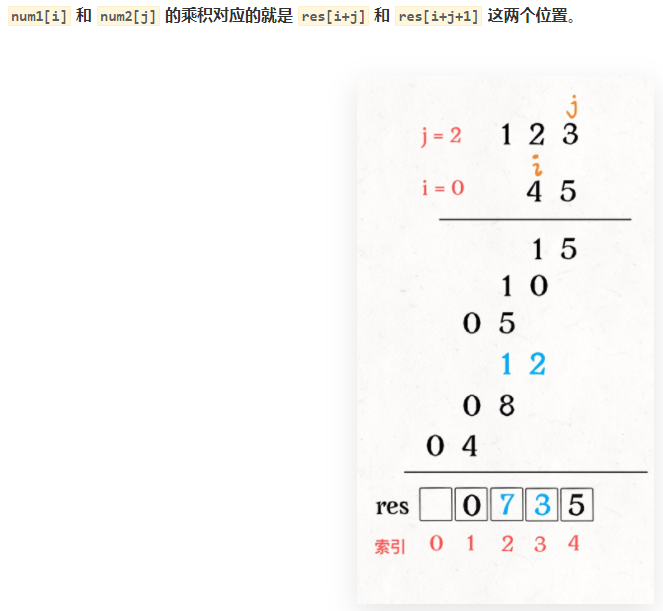

43 [字符串相乘](https://leetcode-cn.com/problems/multiply-strings/)

### 思路

模拟手算乘法，进一步分解


### 代码

```js
var multiply = function(num1, num2) {
    if(num1 === '0' || num2 =='0') return '0';
    let len1 = num1.length,len2 = num2.length;
    //创建res保存结果
    let res = new Array(len1+len2).fill(0)
    //从后往前遍历
    for(let i=len1-1 ; i>=0 ; i--){
        for(let j=len2-1 ; j>=0 ; j--){
            let mul = (num1[i] - '0') * (num2[j] - '0')
            //num1[i] 和 num2[j] 的乘积对应的就是 res[i+j] 和 res[i+j+1] 这两个位置
            let first = i+j,second = i+j+1;
            let ans = mul + res[second]
            //将其加到对应的位置上
            res[second] = ans % 10
            res[first] = Math.floor(ans / 10) + res[first]
        }
    }
    let result = res.join('').replace(/\b(0+)/gi,"")
    return result
};
```

### 注意

`parseInt(a,b)`去除前导0原理是将字符串a转换为b进制的数再返回，而乘法会有一些很大的数值，直接用可能会导致溢出，使其发生改变，所以不能直接用`parseInt`去除前导0
