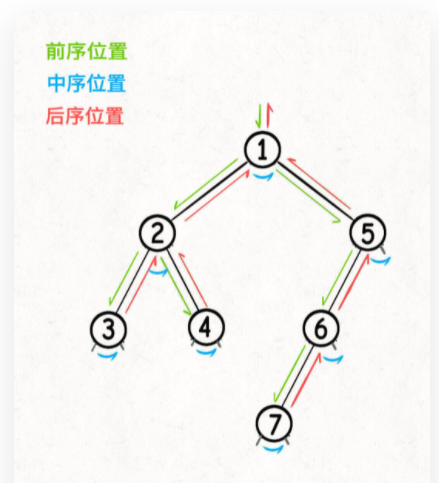

# [104. 二叉树的最大深度](https://leetcode-cn.com/problems/maximum-depth-of-binary-tree/)

### 解题思路
理解二叉树的不同遍历

前序位置的代码在刚刚进入一个二叉树节点的时候执行；

后序位置的代码在将要离开一个二叉树节点的时候执行；

中序位置的代码在一个二叉树节点左子树都遍历完，即将开始遍历右子树的时候执行。


二叉树的**递归**解法

遍历一遍二叉树，用一个外部变量记录每个节点所在的深度，取最大值就可以得到最大深度

### 代码实现1（遍历一遍二叉树）回溯算法核心框架

```js
var maxDepth = function(root) {
    //最大深度
    let res = 0;
    //记录遍历到的节点深度
    let depth = 0;
    //遍历的函数
    let traverse = function (root){
        if(root === null){
            //到达叶子结点，更新最大深度
            res = Math.max(res, depth)
            return
        }
        //前序位置进入一个节点
        depth++;
        traverse(root.left);
        traverse(root.right);
        //后序位置离开一个节点
        depth--;
    }
    traverse(root)
    return res;
};
```

### 代码实现2（动态规划）

```js
var maxDepth = function(root) {
    if(root === null){
        return 0
    }
    //左子树
    let leftMax = maxDepth(root.left)
    //右子树
    let rightMax = maxDepth(root.right)
    //整棵树的maxDepth等于左右子树最大depth再加上根节点自己
    let res = 1+Math.max(leftMax,rightMax)

    return res
};

```

